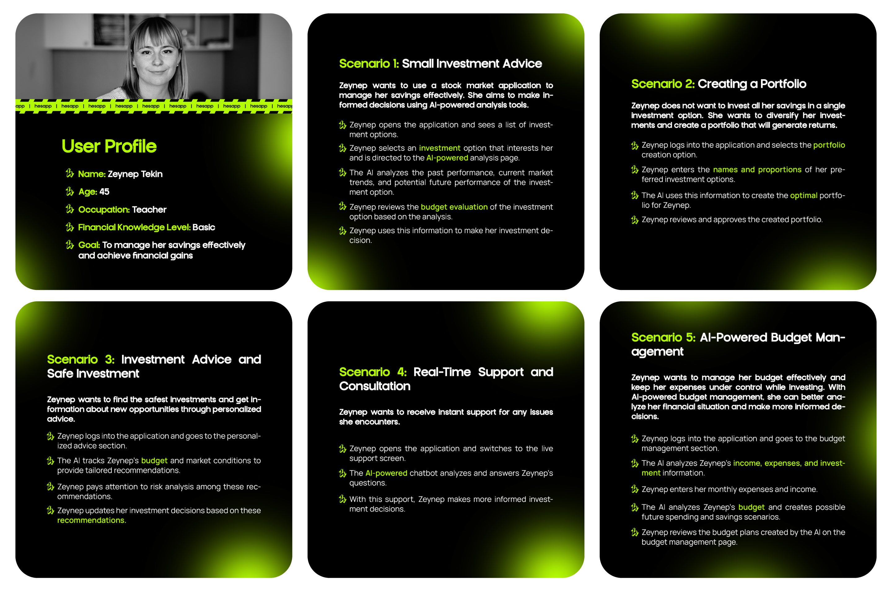
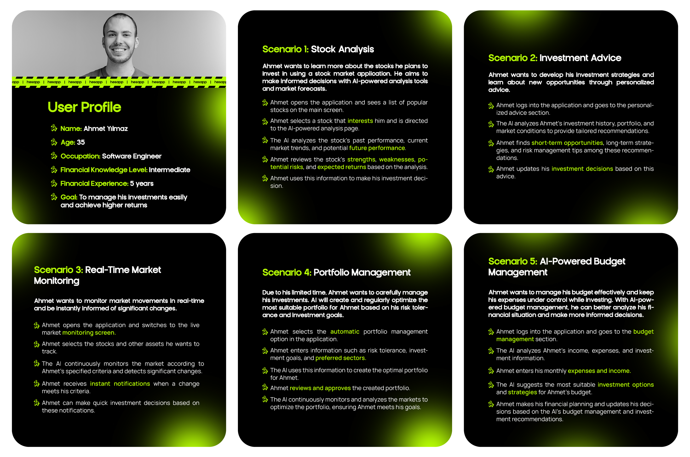
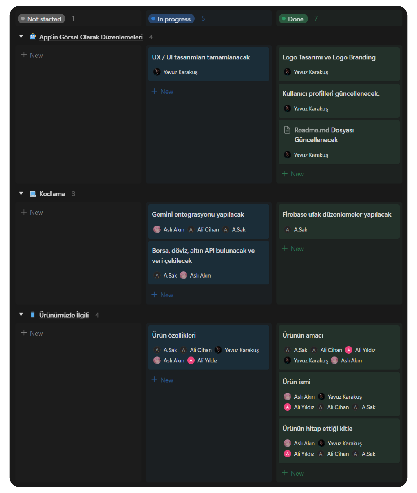
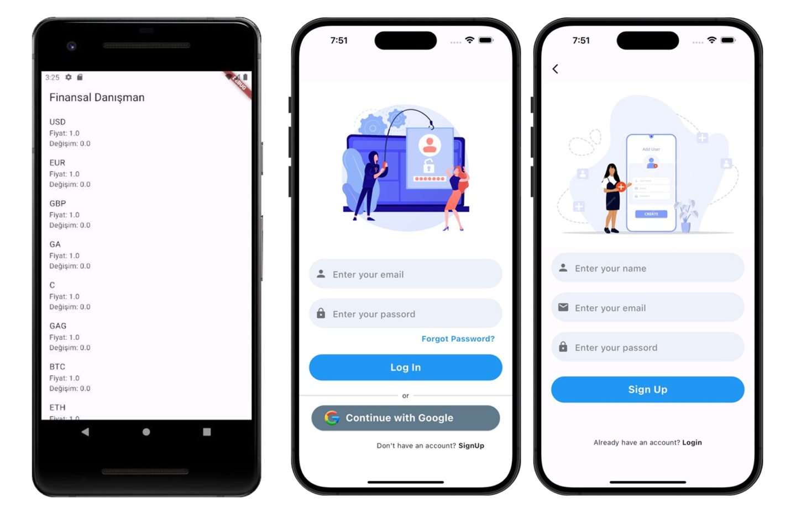
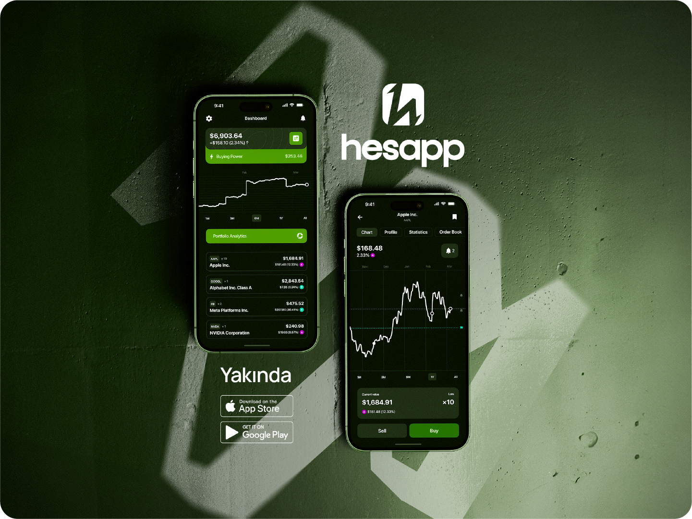

<html lang="en">
<body>


# 🐱‍👤 Team Name

    🦾 | Flutter Team 2

# 📦 Product Information

## 👽 Team Members

 <table>
    <tr>
      <th>#</th>
      <th>Name</th>
      <th>Title</th>
      <th>Links</th>
    </tr>
    <tr>
      <td></td>
      <td>Aslı Akın</td>
      <td>Scrum Master</td>
      <td>
        <a href="https://github.com/azaliyasli" target="_blank"></a>
        <a href="https://www.linkedin.com/in/asl%C4%B1-ak%C4%B1n-17a81628b/" target="_blank" ></a>
        <a href="mailto:slkn521@gmail.com" target="_blank"></a>
      </td>
    </tr>
    <tr>
      <td></td>
      <td>Ahmet Sak</td>
      <td>Product Owner</td>
      <td>
        <a href="https://github.com/ahmet-sak" target="_blank"></a>
        <a href="https://www.linkedin.com/in/ahmet-sak-696a9b187/" target="_blank"></a>
        <a href="mailto:ahmett.sakk@gmail.com" target="_blank"></a>
      </td>
    </tr>
    <tr>
      <td></td>
      <td>Ali Cihan Işıkal</td>
      <td>Developer</td>
      <td>
        <a href="https://github.com/progressiveOverload" target="_blank"></a>
        <a href="https://www.linkedin.com/in/ali-cihan-isikal/" target="_blank"></a>
        <a href="mailto:cihanisikal@outlook.com" target="_blank"></a>
      </td>
    </tr>
    <tr>
      <td></td>
      <td>Ali Yıldız</td>
      <td>Developer</td>
      <td>
        <a href="https://github.com/AliYldzz" target="_blank"></a>
        <a href="https://www.linkedin.com/in/ali-y%C4%B1ld%C4%B1z/" target="_blank"></a>
        <a href="mailto:06.alyildiz.06@gmail.com" target="_blank"></a>
      </td>
    </tr>
    <tr>
      <td></td>
      <td>Yavuz Karakuş</td>
      <td>Developer | Designer</td>
      <td>
        <a href="https://github.com/yavuzkarakus" target="_blank"></a>
        <a href="https://www.linkedin.com/in/yavuzkarakus/" target="_blank"></a>
        <a href="mailto:karakuss.yavuz@gmail.com" target="_blank"></a>
      </td>
    </tr>
  </table>

## 🗿 Product Name


## 🔗 Product Backlog URL

<a href="https://www.notion.so/yavuzkarakus/Gantt-emas-3e5a6e3316a14f8d9497e6563d0a2148?pvs=4"> || **Flutter Team 2 Notion Backlog Board**</a>

## 📕 Product Description

### 👋🏻 Introducing HesApp

`HesApp` is an all-in-one financial management application designed to help you stay on top of your investments, currencies, and budget with ease. Whether you're a seasoned investor or just starting your financial journey, `HesApp` offers a comprehensive suite of features to meet all your financial needs.


### 🔑 Key Features

#### Stock Market Tracking:

- Stay updated with real-time stock market data. Monitor your portfolio, track stock prices, and receive alerts for significant market movements.

#### Gold/Silver Tracking:

- Keep an eye on the fluctuating prices of precious metals like gold and silver. Receive timely updates and alerts to make informed decisions about your investments.

#### Currency Tracking:

- Track real-time exchange rates for multiple currencies. Stay informed about global currency fluctuations and make the best choices for your international transactions.

#### Personalized Stock/Forex/Economy News:

- Get personalized news updates based on your interests. Receive the latest news on stocks, forex, and the economy tailored to your preferences and portfolio.

#### E-Wallet (Optional):

- Manage your digital transactions effortlessly with our integrated e-wallet feature. Securely store your money, make transactions, and keep track of your spending all in one place.

#### AI-Powered Financial Advisor:

- Get expert financial advice at your fingertips with our AI-supported financial advisor. Receive personalized recommendations and insights to help you make the best investment decisions.

#### Budget Management:

- Take control of your finances with our robust budget management tools. Track your income, expenses, and savings, and set financial goals to stay on track.

#### AI-Supported Budget Management Advisor:

- Enhance your budgeting experience with our AI-powered budget management advisor. Receive intelligent advice and suggestions to optimize your budget and achieve your financial goals.

### 🚶🏻‍♂️ User Profiles




###



<hr>

### 👥 Target Audience

- Individual investors
- Financial enthusiasts
- Frequent travelers
- Digital wallet users
- Individuals seeking personalized financial advice
- Budget-conscious individuals

### ❓ Why Choose HesApp?

`HesApp` is designed to simplify financial management. With real-time data, personalized news, and AI-powered advice, managing your finances has never been easier. Stay informed, make smart decisions, and achieve your financial goals with `HesApp`.


# 🕙 Sprint 1

## 📒 Sprint Notes:

⚡ `Notion` application was used for task tracking.

⚡ `Miro` application was used for the idea development phase.

⚡ It has been decided to use `Firebase` for the backend and it was decided to use email and Google login for the login system.

⚡ It has been determined that a chatbot will be used, and for this, `Gemini` will be utilized.

## 💯 Expected Point Completion within Sprint:


### 🧠 Point Completion Logic:

- During this sprint, due to the holiday, we focused more on the idea development phase, visual design of the product, and the basic features of our application, and we also took some steps towards the coding part of our product. We allocated **100** points for the idea development phase and completed all of it. We allocated **200** points for the visual design of our application and we completed all of it. We allocated **250** points for coding but only completed **80** points of it. By the end of Sprint 1, we completed a total of **380** points.

## 🚀 Daily Scrums:

### 📸 Screenshots


## 📅 Sprint Board:

### 📸 Screenshot



## 📱 App Development:

### 📸 Screenshots



## 💬 Sprint Review:

⚡ First, as a team, we decided on an idea and gave our application a name.

⚡ Ali compiled all the user stories for our application.

⚡ Ahmet provided a login or sign-up page for our application with Firebase to allow our users to log in. He also participated in the coding part for the Gemini integration and researched stock market APIs with Aslı.

⚡ Ali Cihan and Aslı also participated in the coding part for the Gemini integration.

⚡ Yavuz designed our logo and the general design of our application. In addition, he visualized those user stories.

⚡ During this sprint, we faced difficulties in the API research part and data retrieval. We also encountered a few issues with the Gemini integration. However, during this process, we learned the most about the field of artificial intelligence.

## 🌱 Sprint Retrospective:

- In the second sprint, we plan to focus more on the coding area and aim to complete the `UX/UI design` and implement it into the code. Additionally, we will find a `stock market API` and complete the integration of `Gemini`.


## 👾 What We Learnt In This Sprint:

🚩 We learned how to fetch data via API in JSON format and add the packages we obtained from multiple pages to the main file.

🚩 We learned that we need to use Generative AI for integration with Gemini.

🚩 We learned how to perform user registration and login operations with Firebase. Users can log into the application with their email addresses and Google accounts. For users trying to log in with their email accounts, a verification link is sent to their registered email addresses. When users forget their passwords, they can set a new password using the "forgot my password" option sent to their registered email address.

```dart
class AuthMethod {
final FirebaseFirestore _firestore=FirebaseFirestore.instance;
final FirebaseAuth _auth=FirebaseAuth. instance;

// SignUp User

Future<String> signupUser ({
  required String email,
  required String password,
  required String name,
}）async {...｝

// logIn user

Future<String> loginUser ({
  required String email,
  required String password,
}）async {...｝

// sign out

Future<void> signOut() async {
await _auth.signOut(); }}
```

🚩 We discovered APIs and solution methods for the news summaries we plan to add to our application using open-source AI-powered scraping sites. We realized that most of these packages are in Python and that we need to work on obtaining the desired data structures through prompt engineering.

```dart
{
"news" : [
    0 : {
         "title": "Fransa'da sandık çıkış anketlerinde sol ittifak sürprizi"
         "abstract" : "07.07.24"
         "image_url" : "https://geoim.bloomberght.com/2024/07/07/ver1720377827/2356030_620x349.jpg"
         }

    1 :  {
         "title" : "Spot piyasada elektrik fiyatları (07.07.24)"
         "abstract" : ""
        }]}
```



## 🔗 Other URLs

<a href="./otherFiles/logo/Hesapp Logo Branding.pdf"> || **Hesapp Logo Branding**</a>

</body>
</html>
